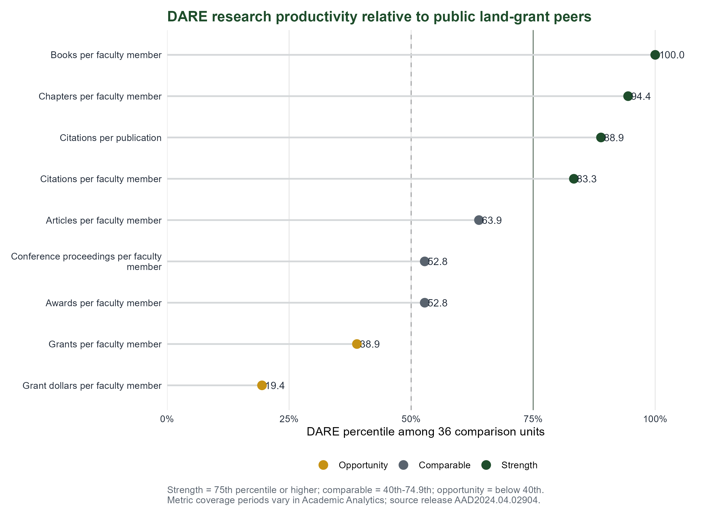

# Section 4: Research and Creative Artistry

## Research as a core component of DARE's mission

Research is central to the Department of Agricultural and Resource Economics (DARE) and to its contribution to Colorado State University's land-grant mission. The department conducts rigorous disciplinary and multidisciplinary research that develops knowledge and tools to improve societal well-being by addressing economic, managerial, educational, and policy problems within agri-food and resource systems. DARE seeks recognition from academic, industry, government, and community stakeholders as a collective leader in Environmental and Natural Resource Economics (ENRE), Agricultural and Food Economics (AFE), and Agricultural Education (AgEd).

For DARE, the principal documented forms of research and creative accomplishment are peer-reviewed publications, other juried scholarly works, sponsored projects, research collaboration, competitive recognition, and student research mentoring. These forms reflect the work of an applied social science department whose faculty appointments combine research with teaching, Extension, engagement, and service.

## Research areas

DARE's research portfolio is organized around three connected areas. Appendix Table A1 summarizes the faculty composition of these areas, and Appendix Table D2 reports peer-reviewed publications by research area.

### Agricultural and Food Economics

Agricultural and Food Economics faculty study agricultural production, food markets, food security, food retail, consumer behavior, and rural economic development. Nineteen DARE faculty contributed to this area during the review period. Research in agricultural production addresses livestock markets, rangeland management, climate risk, technology adoption, supply-chain resilience, and structural change in agriculture. Food security research examines how income, employment, demographic characteristics, public programs, and household constraints affect food access and diet quality. Faculty working in food markets study retail competition, pricing, product differentiation, labeling, consumer demand, and the organization of food supply chains. Rural development research considers local and regional food systems, agritourism, entrepreneurship, health-care access, labor markets, and the economic conditions of rural communities. Research on local food systems commonly joins work from across faculty research areas, including farm viability, market access, consumer demand, and community development. Work on food security draws on both household behavior and the structure of retail food markets.

### Environmental and Natural Resource Economics

Environmental and Natural Resource Economics faculty examine how individuals, firms, communities, and public agencies respond to the management of water, land, wildlife, wildfire, energy, and other natural resources. Ten DARE faculty contributed to this area during the review period. Water research addresses groundwater depletion, aquifer management, municipal pricing, conservation behavior, and the resilience of water systems to environmental hazards. Research on wildfire considers suppression costs, public resource allocation, labor and health effects, community exposure, and retention of the wildland firefighting workforce. Faculty working in energy study electricity markets, renewable generation, carbon markets, and interactions among energy production, land use, and environmental regulation. Wildlife and land research addresses human-wildlife conflict, livestock and rangeland management, conservation incentives, land-use change, and the economic consequences of environmental policy. Within this area, research frequently overlaps: research on wildfire connects air quality, water systems, agricultural labor, public lands, and energy production. Work on rangelands joins wildlife conservation, agricultural production, and rural livelihoods.

### Agricultural Education

Agricultural Education faculty study how agricultural knowledge is taught, learned, and applied in schools, communities, and professional settings. Three DARE faculty contributed to this area during the review period. Current work addresses agricultural literacy, teacher preparation, pedagogical content knowledge, psychomotor skill development, educator retention, and the role of professional communities in supporting school-based agricultural education. This scholarship is integrated with teaching and outreach. Faculty use research on learning and educator preparation to inform undergraduate instruction, teacher-development programs, and agricultural literacy activities throughout Colorado. The cluster supports the preparation of future agricultural educators and connects educational research with the needs of schools, teachers, students, and agricultural communities.

## Scholarly productivity and influence

From 2021 through August 2026, DARE faculty produced 264 unique peer-reviewed journal publications (Table 4.1). Those articles generated 344 faculty-publication credits, with one credit recorded for each DARE faculty member who contributed to an article. The credit total therefore recognizes both solo-authored and coauthored faculty contributions, while the unique publication total counts each article only once for the department. Fifty-seven publications included two or more DARE faculty authors.

**Table 4.1. Peer-reviewed journal publication productivity, 2021–2026**

| Year | Active tenure-track faculty | Unique department publications | Faculty-publication credits |
|---:|---:|---:|---:|
| 2021 | 24 | 48 | 66 |
| 2022 | 23 | 44 | 54 |
| 2023 | 25 | 39 | 55 |
| 2024 | 26 | 48 | 59 |
| 2025 | 25 | 57 | 77 |
| 2026 partial | 25 | 28 | 33 |
| **Total** |  | **264** | **344** |

This output was sustained across a mixed appointment portfolio. Annual active tenure-track headcount ranged from 23 to 26 during the five completed years, but only a portion of each appointment was assigned to research. The combined research assignment ranged from 8.06 to 9.56 full-time equivalents. DARE therefore maintained a substantial publication portfolio while faculty also carried teaching, Extension, engagement, and service responsibilities. Appendix Figures D1 and D2 show annual output and place it in the context of both faculty headcount and research assignment.

The publication record also demonstrates scholarly reach (Table 4.2). The 264 articles had accumulated 4,649 manually verified Google Scholar citations, an average of 17.61 citations per publication, and 85.6 percent had been cited at least once. Older publications have had more time to accumulate citations, so annual citation totals should be read by publication cohort rather than as a measure of performance in a single year.

**Table 4.2. Citation and journal-placement indicators by publication year, 2021–2026**

| Publication year | Publications | Google Scholar citations | Mean citations per publication | Median citations per publication | Percentage cited | Publication-weighted average journal IF |
|---:|---:|---:|---:|---:|---:|---:|
| 2021 | 48 | 1,989 | 41.44 | 20.00 | 97.92% | 6.57 |
| 2022 | 44 | 1,188 | 27.00 | 17.50 | 93.18% | 4.17 |
| 2023 | 39 | 539 | 13.82 | 9.00 | 97.44% | 4.16 |
| 2024 | 48 | 593 | 12.35 | 6.50 | 85.42% | 3.32 |
| 2025 | 57 | 286 | 5.02 | 3.00 | 77.19% | 5.90 |
| 2026 partial | 28 | 54 | 1.93 | 1.00 | 53.57% | 6.32 |
| **Total** | **264** | **4,649** | **17.61** | **6.00** | **85.61%** | **5.07** |

Journal placement provides complementary evidence of research quality. Impact-factor values were available for 214 publications. The mean was 5.07 and the median was 3.58, with values from 0.50 to 63.71. The annual publication-weighted average increased from 3.32 in 2024 to 5.90 in 2025 and 6.32 in partial-year 2026. Although recent articles have had less time to receive citations, they appeared, on average, in journals with stronger citation profiles than the 2022 through 2024 cohorts. The portfolio therefore combines consistent placement in established disciplinary and applied journals with selected publications in journals that have unusually broad reach.

The venues reinforce this interpretation. As shown in Table 4.3, DARE faculty published 21 articles in *Applied Economic Perspectives and Policy* and 11 each in the *American Journal of Agricultural Economics*, *Rangeland Ecology & Management*, and *Western Economics Forum*. Other recurring venues include *Food Policy*, *Q Open*, *Choices*, the *Journal of the Agricultural and Applied Economics Association*, and the *Journal of Agricultural and Resource Economics*. This mix reaches core disciplinary audiences as well as policy, producer, and practitioner communities.

**Table 4.3. Journals with the largest numbers of DARE publications**

| Journal | Publications | Average impact factor | Total Google Scholar citations | Average Google Scholar citations per publication |
|---|---:|---:|---:|---:|
| Applied Economic Perspectives and Policy | 21 | 4.57 | 416 | 19.81 |
| American Journal of Agricultural Economics | 11 | 4.29 | 483 | 43.91 |
| Rangeland Ecology & Management | 11 | 2.71 | 67 | 6.09 |
| Western Economics Forum | 11 | Not available | 42 | 3.82 |
| Food Policy | 7 | 6.37 | 85 | 12.14 |
| Q Open | 7 | 2.30 | 117 | 16.71 |
| Choices | 7 | Not available | 45 | 6.43 |
| Journal of the Agricultural and Applied Economics Association | 6 | 1.80 | 22 | 3.67 |
| Journal of Agricultural and Resource Economics | 6 | 1.38 | 37 | 6.17 |
| Translational Animal Science | 5 | 1.84 | 45 | 9.00 |

Appendix Table D3 reports the portfolio's 12 peer-reviewed book chapters, one conference proceeding, and nine other juried or peer-reviewed scholarly works separately from journal publications.

### Position relative to public land-grant peers

Academic Analytics provides a consistent basis for positioning DARE within the Agricultural Economics discipline. The comparison group includes 36 public land-grant units and initially contained 745 faculty. The Academic Analytics roster included four DARE faculty without a research role for this benchmark. Removing those faculty produced a 21-member research-active DARE unit and an adjusted comparison population of 741 faculty. The filtered Academic Analytics unit model is used for the comparisons below because its unit-level publication and citation totals count a coauthored work once, whereas summing faculty records would count the same work once for each participating DARE faculty member.

With the research-active roster, DARE's Scholarly Research Index (SRI) is 0.4, placing the department in a tie for fourth among the 36 comparison units with a percentile rank of 91.7 (Appendix Table B1 and Appendix Figure B1). Before the roster adjustment, DARE's SRI was 0.1 with a percentile rank of 66.7. The change does not add scholarly output; it aligns the faculty denominator with the group whose research activity is being evaluated. The result indicates that DARE's combined record of scholarly output and influence is strong relative to similarly situated public land-grant departments.

The peer indicators distinguish the amount of scholarship DARE produces from the influence and range of that work (Appendix Table B2 and Figure 4.1); Appendix Table D4 provides additional citation measures. DARE's clearest comparative strengths are books and chapters per faculty member, which rank at the 100th and 94.4th percentiles, respectively, and citation performance: citations per publication rank at the 88.9th percentile and citations per faculty member at the 83.3rd percentile. Article production per faculty member is also above the peer-group midpoint, at the 63.9th percentile, while awards and conference proceedings are near the midpoint. DARE's contribution to the comparison group shows the same pattern. Its 21 research-active faculty constitute 2.8 percent of the peer-group faculty but account for 3.2 percent of its articles, 11.0 percent of its books, and 8.2 percent of its chapters (Appendix Figure B3). Thus, DARE's strongest comparative advantage is not unusually high article volume; it is the citation reach of its publications and its substantial contribution to books and chapters.

**Figure 4.1. DARE research productivity relative to public land-grant peers**

Academic Analytics identifies sponsored-project activity as a comparative opportunity. DARE ranks below the peer-group midpoint for grants per faculty member, at the 38.9th percentile; its percentile ranks for dollars per grant and grant dollars per faculty member are 22.2 and 19.4, respectively. These figures provide a standardized comparison with disciplinary peers, but they do not measure the same projects or reporting period as CSU's administrative records. The following section therefore uses data from the Office of the Vice President for Research to examine DARE's 2021–2026 proposals and awards directly. Read together, the two sources show both DARE's demonstrated capacity to lead major sponsored initiatives and an opportunity to broaden the number and scale of funded projects across the faculty.

## Sponsored research leadership and portfolio development

DARE was the lead unit on 153 proposals submitted during the 2021–2026 reporting window (Table 4.4). Eighty-five proposal records were marked as funded, representing 55.6 percent of all DARE-led proposals and $63.42 million in total award value. The award count and award dollars measure different aspects of performance: the former is the number of funded project records, while the latter is the combined value of those awards. The 55.6 percent figure is a provisional proxy for proposal success, not a final success rate. Records with a blank status combine proposals that were unsuccessful with proposals still in progress; calculating a final success rate would require distinguishing between those two outcomes. The 2026 results are partial.

**Table 4.4. DARE-led sponsored-project activity by proposal year, 2021–2026**

| Year | Proposals submitted | Funded award count | Total award dollars | Average award amount |
|---:|---:|---:|---:|---:|
| 2021 | 27 | 19 | $3,275,393 | $172,389 |
| 2022 | 36 | 23 | $5,168,809 | $224,731 |
| 2023 | 30 | 17 | $52,740,418 | $3,102,378 |
| 2024 | 34 | 16 | $1,031,587 | $64,474 |
| 2025 | 20 | 8 | $1,082,918 | $135,365 |
| 2026 partial | 6 | 2 | $124,000 | $62,000 |
| **Total** | **153** | **85** | **$63,423,126** | **$746,154** |

Faculty leadership was distributed across the department. The number of active, rostered DARE faculty serving as principal investigator or co-principal investigator on a CAS project was 15 in 2021, 16 in 2022, 15 in 2023, 16 in 2024, 12 in 2025, and seven in partial-year 2026. These are annual counts, so a faculty member active in several years appears in each relevant year. Appendix Table C1 reports the separate PI and co-PI counts and the share of active faculty in either role.

Among the five College of Agricultural Sciences (CAS) academic departments represented in the same records, DARE ranked fifth in proposals submitted and funded-project count, second in total award dollars, and first in average award amount. Its share of submitted proposals marked as funded ranked second, although this remains a provisional comparison because blank-status proposals cannot be separated into unsuccessful and pending records (Appendix Table C7). This profile reflects a department that submits and receives fewer projects than several larger or laboratory-based units but has demonstrated an ability to lead work at substantial scale. Comparisons based only on award volume should also recognize differences in research models. Unlike departments that require laboratories, experimental facilities, field infrastructure, or large equipment budgets, DARE research is more commonly supported through faculty and student time, data, computing, travel, and partner engagement. DARE's second-place rank in award dollars and first-place rank in average award amount are therefore notable, but expenditures per faculty member will provide a more appropriate comparison when those data become available.

The clearest example is the $50.0 million Northwest Mountain Food Business Center award led by Dawn Thilmany as principal investigator. It accounts for much of the 2023 award total and demonstrates DARE's capacity to coordinate a major regional initiative. The funded portfolio nevertheless extends beyond one award. It involved 31 originating sponsors, including 21 awards from the USDA National Institute of Food and Agriculture totaling $4.20 million and six awards from the USDA Forest Service Rocky Mountain Research Station totaling $1.27 million. Appendix Table C3 reports awards by originating sponsor.

Federal sponsors accounted for 62 awards and $60.18 million, or 94.9 percent of DARE's award dollars. Appendix Table C2 shows annual award counts and dollars for federal, state, CSU or internal, foundation or nonprofit, industry, and other originating-source categories. The three largest originating sponsors accounted for 88.8 percent. These figures document a strong and productive federal partnership base, particularly with USDA, while also identifying portfolio concentration as an anticipated challenge. Sponsor diversification would reduce exposure to shifts in federal programs and create additional pathways for research with state agencies, foundations, nonprofit organizations, producer groups, and industry partners where missions align.

Sponsored activity also demonstrates two-way collaboration within CAS. Investigators from other CAS units participated on DARE-led projects, including Animal Sciences on nine projects, Agricultural Biology on two, and Horticulture and Landscape Architecture on one. DARE faculty also served as principal investigator or co-principal investigator on 29 proposals led by other CAS units; six were funded for $1.97 million. These relationships allow economic analysis, markets, policy, and education to complement biological, production, and natural-resource expertise. Appendix Table E2 reports the participating units and funded status.

University pass-through awards further extend the department's research network. DARE worked through 27 external higher-education institutions on 51 proposals; 30 funded awards involving 19 pass-through institutions totaled $2.02 million. Appendix Figure C1 compares the facilities and administrative (F&A) rates reported for DARE-led awards with those reported by the other CAS academic departments and separates pass-through institutions from other sponsor types. DARE's median reported rate was 15 percent, compared with 10 percent for the other CAS departments combined; for pass-through awards, the corresponding medians were 35 percent and 11.11 percent. The comparison shows that DARE's rates were higher overall and for pass-through awards, while median federal rates were the same. Because F&A rates apply to different eligible cost bases and award terms, they do not reveal how many dollars ultimately supported faculty, staff, students, or other direct research costs.

Award values should not be presented as research expenditures. Awards record sponsored resources committed to projects, often across several years, while expenditures show when and how those resources were used. Comparable expenditure and graduate research assistant data were not available for this review, so the analysis does not estimate expenditures per faculty member or the share of sponsored resources supporting graduate researchers.

## Interdisciplinarity and the scope of impact

Interdisciplinarity is visible within the department, across CSU, and through external scholarly partnerships. Fifty-seven of the 264 peer-reviewed publications, or 21.6 percent, included two or more DARE faculty members. Twelve publications crossed DARE research areas. Appendix Table E1 reports within-department collaboration by year. These collaborations bring different methods and substantive expertise to problems that do not fall within a single field, including wildfire, food access, water management, rangelands, agricultural labor, supply chains, and rural development.

To assess collaboration beyond DARE, the department used OpenAlex to examine the institutional affiliations of publication coauthors. OpenAlex is an open catalog of scholarly works, authors, institutions, and citation relationships. It is used here for structured authorship and affiliation information, not for the citation indicators reported above.

At least one external institutional affiliation was identified on 192 of the 264 peer-reviewed publications. The documented network includes 326 external institutions: 195 universities or other educational institutions, 37 government organizations, and additional nonprofit, industry, research-facility, and other partners. It includes 180 U.S. institutions and 141 institutions across 40 other countries, with country information unavailable for five institutions. The University of Wyoming was the most frequent identifiable university collaborator, appearing on 24 publications. Recurring partners also included the USDA Agricultural Research Service, USDA Economic Research Service, Kansas State University, Texas A&M University, Appalachian State University, Cornell University, and the Rocky Mountain Research Station. Appendix Table E3 summarizes these external publication and sponsored-project relationships.

Academic Analytics provides a complementary, more narrowly defined view using the same 21-member research-active roster used for peer benchmarking. After the four non-research faculty were excluded, Academic Analytics identified 19 within-DARE faculty pairs, publication links with 14 other CSU units, and publication links with 31 external institutions. The strongest CSU-unit relationships were with Animal Sciences, Atmospheric Science, and Human Dimensions of Natural Resources; the strongest external institutional relationships were with Purdue University, the University of Wyoming, and Texas A&M University. These values count faculty-to-collaborator article links rather than unique publications and use Academic Analytics' coverage period, so they supplement rather than replace the broader OpenAlex totals. Appendix Figures E1 and E2 summarize these relationships.

This network amplifies impact in three ways. First, it connects DARE's disciplinary expertise with complementary scientific, educational, and policy knowledge. Second, relationships with federal research agencies and land-grant universities increase access to data, field settings, stakeholders, and multistate problems. Third, national and international coauthorship broadens the audiences and settings in which DARE's research is tested and used. Because affiliation information was not available for every publication, these counts are a conservative description of the network.

Perhaps the most important multi-state collaborations to highlight for our department is illustrated I our membership of the USDA NIFA regional research research and coordinating committees.  We have 10 faculty active in projects (many which were updated over the past 5 years), crossing the knowledge areas of Economics of Agricultural Production and Farm Management, Consumer Economics, Community Resource Planning and Development, Marketing and Distribution Practices, International Trade and Development, Natural Resource and Environmental Economics, Sociological and Technological Change and Communication, Education and Information Delivery.  These teams have large and diverse cross-state collaborations, and actually, through these committees our faculty collaborate with faculty from every state except for Delaware.  

Looking at our project reports from over the past 5 years, we used CoPilot to summarize these key themes and contributions to Colorado stakeholders from our faculty’s collaborative research projects.

1.	Food systems leadership and statewide technical assistance through the USDA Food Business Center DARE supports Colorado food and ag enterprises with entrepreneurial programs, TA for food/ag businesses, and community food assessments (e.g., Northern Colorado, SLV), helping communities plan resilient food system investments. “Developing food business based entrepreneurial programs… technical assistance programs… helped communities complete food assessments (SLV, Northern Colorado).”
2.	Colorado based applied research informing policy and investment decisions DARE projects generate evidence on recreation economies and climate smart agriculture, shaping state agency strategies and informing Colorado policies and regulatory programs.
3.	Statewide rural economic development support through REDI and CSU Extension DARE collaborations leverage the leadership capacity of Colorado communities by providing data tools, economic indicators, and bi monthly REDI reports that help local leaders evaluate workforce trends, housing, public services, and economic opportunities. Multiple regions used faculty and student-led studies, metrics, and internships to shape decisions around outdoor recreation economies, agritourism, open lands, and food system investments. “Economic development partners… guide economic development decisions… Fisher’s Peak, Craig open lands, Yuma agritourism… Pueblo Food Project.”
4.	Strengthening rural urban interdependence through data platforms and decision tools Colorado counties benefit from new metrics and dashboards that allow them to compare themselves to state trends and track progress over time—supporting more informed local governance and investment. “New data metrics that all counties can access… how their area compares to the state… how those data change across time.”
5.	Collaborative programming with Colorado institutions (community colleges, producer associations, local governments) DARE faculty and students co create entrepreneurial programs, producer focused training, and community driven initiatives that expand economic opportunity and build capacity across rural Colorado. “Co creating entrepreneurial programs with community colleges and producer associations.”

## Faculty distinction and opportunities for recognition

DARE's scholarly influence is also reflected in competitive recognition and leadership. Departmental records identify 53 competitive awards across research, teaching, Extension, service, and student achievement during the review period. All required an application. Fourteen recognized students, while 39 recognized faculty, staff, or alumni. Nineteen faculty awards were categorized as research awards, fellowships, or scholarly recognitions. Awarding organizations included CAS, CSU, the Agricultural and Applied Economics Association, the Western Agricultural Economics Association, and the Farm Foundation. Appendix Table F1 lists the research awards and awarding organizations rather than organizing the public-facing presentation around individual recipients.

Several faculty records merit consideration for further university and disciplinary recognition. Dawn Thilmany's leadership of the $50.0 million Northwest Mountain Food Business Center provides evidence of large-scale sponsored-project leadership. Within the reviewed publication portfolio, John Ritten had the largest number of peer-reviewed journal articles, with 36; Jude Bayham's 24 publications had accumulated the largest citation total, with 741; Amanda Countryman's 21 publications had accumulated 356 citations; and Jesse Burkhardt's 18 publications had accumulated 243 citations. These faculty members have received college-level recognition, and their records of publication volume, citation reach, collaborative leadership, and sponsored-project leadership support consideration for university and disciplinary awards.

DARE has an awards committee that encourages high-performing faculty to pursue recognition and assists in identifying appropriate opportunities. Faculty success at the college level provides a foundation for the committee to place greater emphasis on university awards, disciplinary-association honors, fellow designations, interdisciplinary awards, editorial leadership, and public-impact recognition. Matching each opportunity to the relevant combination of scholarship, service, mentoring, and sponsored-project leadership will strengthen future nominations.

DARE also supports the development and retention of faculty researchers through onboarding, a formal mentor committee for pre-tenure faculty, annual review by the full promotion-and-tenure committee, and at least annual individual meetings with the department head. Associate professors may opt into a new mentor committee with a less formal structure. These mechanisms provide recurring opportunities to set research priorities, assess progress, identify barriers, and connect faculty with collaborators and recognition opportunities.

## Research engagement and student preparation

Student participation connects faculty scholarship directly to DARE's educational mission. Seventy-five scholarly outputs during 2021 through partial-year 2026 included an identified student coauthor. Annual counts increased from 10 in 2021 to 18 in 2024 and remained at 16 in 2025, with four recorded for partial-year 2026. Appendix Tables G1 and G2 report the annual totals and output-level details. Coauthorship gives students experience in framing research questions, applying disciplinary methods, interpreting results, responding to peer review, and communicating findings to professional audiences. These are skills that support preparation for doctoral study, public agencies, nonprofit organizations, and private-sector analytical careers.

Graduate committee participation provides a second indicator of research mentoring. During the review period, 441 faculty committee memberships began: 80 in 2021, 66 in 2022, 100 in 2023, 76 in 2024, 85 in 2025, and 34 in partial-year 2026. Each membership represents one faculty member beginning service in one recorded role on a graduate committee, not a unique student or a count of all committees active in that year. Students also received 14 of the department's 53 documented competitive awards.

Together, these measures show that research is not separate from student development. Students contribute to publishable scholarship, work with faculty through graduate committees, use the department's computing and proprietary data resources, and compete successfully for recognition. Current projects show students applying economic methods to food choice, health policy, flooding, wildfire, and consumer behavior. The current quantitative evidence is strongest for publications, committee roles, and awards. A fuller account should connect these activities to research assistant appointments, conference participation, community-engaged projects, and career outcomes.

## Research data and computing capacity

DARE has invested faculty effort and resources in computing services that allow students, faculty, and collaborators to store and process large datasets. The department has also developed access to proprietary data resources, including consumer scanner data, store-location data, sensory-panel data, and foot-traffic data. This infrastructure gives students experience with the large, complex datasets increasingly used in academic, government, and private-sector research.

Current student projects illustrate the range of work these resources support. Students are linking sensory-panel and consumer scanner data to study demand for plant-based foods, combining tide-gauge and scanner data to examine how nuisance flooding changes household food purchases, and using consumer panel and health information to investigate how insurance policies affect food spending. Other students are using data products available through Dewey to study wildfire-related questions.

These projects provide practical training in data management, record linkage, econometric analysis, research design, and responsible use of proprietary information. Shared infrastructure also makes specialized data available to multiple students and research teams rather than limiting access to a single investigator. This capacity can help distinguish DARE from peer programs by supporting student research across food, health, environmental, and natural-hazard topics. Sustaining it will require continuing support for data licenses, secure storage, computing capacity, technical administration, and clear access and data-governance procedures.

## Strengths, anticipated challenges, and resource priorities

DARE enters the next review period with a productive publication portfolio, evidence of strong journal placement and citation reach, capacity to lead sponsored work at regional scale, and broad internal and external collaboration. The department's research also creates documented opportunities for students to participate in scholarship and receive competitive recognition. These are mutually reinforcing strengths: collaboration expands the questions the department can address, sponsored projects provide settings and resources for applied work, and student participation connects research to the department's instructional mission.

The principal challenge is to sustain these strengths while improving the breadth, visibility, and resilience of the research enterprise. Appendix Table H1 connects the evidence in this section to anticipated challenges, practical resource needs, and intended effects.

Six substantive opportunities follow from this assessment. First, DARE should maintain the public land-grant benchmark established in this review, document the metric windows, and determine whether an R1-only sensitivity comparison is needed. Second, the department should maintain its federal and USDA strengths while developing a broader sponsor and partner portfolio. Third, it should use interdisciplinary seed support and proposal development to turn established relationships into durable programs of research. Fourth, it should connect student research participation more explicitly to skill development and career outcomes and secure the assistantship and research-experience resources needed to expand that participation. Fifth, the existing awards committee should build on faculty success at the college level by pursuing university and disciplinary recognition for records of publication reach, sponsored leadership, service, mentoring, and public impact. Sixth, the department should anticipate faculty recruitment and retention needs through a multiyear hiring plan and sustain the data, computing, software, research-staff, and collaborative infrastructure required for applied social science research.

Two reporting practices will make progress on these priorities easier to demonstrate in future reviews. DARE should establish an annual research-output update process that records publications, citations, grants, awards, student participation, and external collaborators in a consistent format. Faculty should also maintain ORCID records and current Google Scholar profiles to improve matching, reduce duplicate records, and support external benchmarking.

## Sources and additions needed for the final draft

- Faculty curriculum vitae and DARE faculty appointment records.
- CSU-authenticated [Academic Analytics](https://shibidp.colostate.edu/idp/profile/SAML2/Redirect/SSO?execution=e1s1) resources for public land-grant peer comparisons, Scholarly Research Index measures, and collaboration indicators.
- Colorado State University Office of the Vice President for Research [research reporting dashboard](https://app.powerbi.com/groups/me/reports/40008123-e164-47fe-9b31-852ffad3721b/ReportSection9a8e3d69e0413594d388?ctid=afb58802-ff7a-4bb1-ab21-367ff2ecfc8b&experience=power-bi&bookmarkGuid=9951fc43-7f18-43c5-8393-17f6583f9343) and [Proposal and Award History Search](https://vprweb.research.colostate.edu/Proposal-Award-History-Search/).
- Colorado State University [Institutional Research, Planning and Effectiveness](https://www.ir.colostate.edu/) resources for institutional and student indicators.
- DARE faculty and student recognition records.
- Departmental descriptions of shared computing infrastructure, proprietary data resources, and active faculty and student research projects.
- Graduate committee and degree-completion records.
- Manually verified Google Scholar citation counts.
- Journal Citation Reports impact-factor information.
- OpenAlex authorship and institutional-affiliation records.

## Proposed placement of tables and figures

The strategically framed narrative should retain only the tables needed to establish the principal findings. Supporting detail should remain in the appendices and in the consolidated report-table workbook.

Main text:

1. Table 4.1. Peer-reviewed journal publication productivity, 2021–2026.
2. Table 4.2. Citation and journal-placement indicators by publication year, 2021–2026.
3. Table 4.3. Journals with the largest numbers of DARE publications.
4. Table 4.4. DARE-led sponsored-project activity by proposal year, 2021–2026.
5. Figure 4.1. DARE research productivity relative to public land-grant peers.

Appendices:

1. Department composition and research-area detail.
2. Full Academic Analytics peer tables, SRI distribution, market-share comparison, and citation benchmarks.
3. Sponsored awards by source, sponsor, pass-through institution, CAS department, and collaboration direction, together with F&A distributions.
4. Publication detail by research area, output type, journal, impact factor, and faculty capacity, including annual publication figures.
5. Within-department, CSU, external, and multistate collaboration tables.
6. Competitive recognitions and scholarly service.
7. Student research participation and student-coauthored output detail.
8. Appendix Table H1. Research strengths, anticipated challenges, and resource priorities.

## Appendix H. Strategic assessment

### Appendix Table H1. Research strengths, anticipated challenges, and resource priorities

| Evidence and strength | Anticipated challenge or opportunity | Resource or action needed | Intended effect |
|---|---|---|---|
| 264 peer-reviewed publications and 344 faculty-publication credits across mixed appointments | Sustain output and quality as teaching, Extension, and service demands continue | Protect research time where strategically warranted; maintain access to data, software, and research assistance | Preserve scholarly productivity and support ambitious work |
| Strong journal placement and 4,649 verified citations; SRI percentile rank of 91.7 among public land-grant peers | Maintain a consistent benchmark and test whether conclusions change under an R1-only comparison | Secure recurring Academic Analytics access, document metric windows and faculty inclusion rules, and assign responsibility for annual benchmarking | Support defensible claims about national standing and identify specific areas for improvement |
| $63.42 million in awards and leadership of a $50.0 million regional initiative | Reduce dependence on a small number of federal sponsors without weakening productive USDA relationships | Provide proposal-development support, interdisciplinary seed funding, and partner development for state, foundation, nonprofit, and mission-aligned industry opportunities | Increase portfolio resilience and create new pathways for impact |
| Two-way CAS project collaboration and 326 documented external publication partners | Convert broad relationships into sustained interdisciplinary programs and proposals | Support cross-college team formation, shared research staff, and development of multistate and multi-institution proposals | Extend the scope, competitiveness, and application of DARE research |
| 75 student-coauthored outputs, 441 new faculty committee roles, and 14 student awards | Expand access to research experiences and document career outcomes | Increase graduate research assistant, undergraduate research, travel, data, and software support; record participation and outcomes consistently | Prepare students for research-intensive academic, public, nonprofit, and private-sector careers |
| Competitive faculty recognition and several evidence-based nomination prospects | Translate scholarly accomplishment into greater disciplinary visibility | Continue the awards committee's nomination planning and provide administrative support for nomination packages | Increase consideration for university awards, fellowships, association honors, editorial leadership, and national recognition |
| Strong award data but no comparable expenditure series | Demonstrate how sponsored resources support people, students, and research activity | Obtain annual expenditure and appointment data from central and college systems | Distinguish awards from expenditures and support valid CAS and R1 comparisons |
| Breadth across AFE, ENRE, and AgEd | Recruit and retain faculty in priority fields while maintaining coverage during retirements and departures | Use a multiyear hiring plan, competitive start-up support, mentoring, and clear workload expectations | Preserve disciplinary depth and support emerging research priorities |
| Shared computing services and proprietary consumer, retail, sensory, location, and foot-traffic data | Sustain and expand infrastructure that depends on licenses, secure storage, technical administration, and responsible data governance | Maintain data licenses, computing and storage capacity, technical support, research staff, software, survey and fieldwork support, and clear access procedures | Differentiate DARE from peer programs and support externally competitive faculty and student research |
