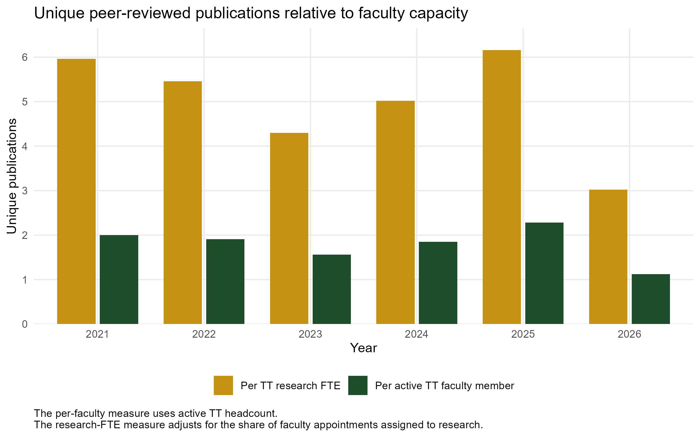

# Section 4: Research and Creative Artistry

## Research mission and departmental profile

The Department of Agricultural and Resource Economics (DARE) conducts high-quality and rigorous disciplinary and multidisciplinary research that develops knowledge and tools to improve societal well-being by addressing economic, managerial, educational, and policy problems within agri-food and resource systems. The department seeks recognition from academic, industry, and policy stakeholders as a collective leader in Environmental and Natural Resource Economics (ENRE), Agricultural and Food Economics (AFE), and Agricultural Education (AgEd).

These areas serve as research clusters within the department. They reflect disciplinary subfields and align faculty research, teaching, and Extension activities with the needs of Colorado and its stakeholders. The faculty snapshot identifies 19 faculty associated with Agricultural and Food Economics, 10 with ENRE, and three with Agricultural Education during some portion of the 2021–2026 review period. Faculty collaborate across these areas through publications, sponsored projects, and graduate committees. **Appendix Table A1** documents faculty appointments, research areas, and active years.

## Research areas

### Environmental and Natural Resource Economics

Environmental and Natural Resource Economics faculty examine how individuals, firms, communities, and public agencies respond to the management of water, land, wildlife, wildfire, energy, and other natural resources. Ten DARE faculty contributed to this area during the review period. Water research addresses groundwater depletion, aquifer management, municipal pricing, conservation behavior, and the resilience of water systems to environmental hazards. Research on wildfire considers suppression costs, public resource allocation, labor and health effects, community exposure, and retention of the wildland firefighting workforce. Faculty working in energy study electricity markets, renewable generation, carbon markets, and interactions among energy production, land use, and environmental regulation. Wildlife and land research addresses human-wildlife conflict, livestock and rangeland management, conservation incentives, land-use change, and the economic consequences of environmental policy. Within this area, research frequently overlaps: research on wildfire connects air quality, water systems, agricultural labor, public lands, and energy production. Work on rangelands joins wildlife conservation, agricultural production, and rural livelihoods.

### Agricultural and Food Economics

Agricultural and Food Economics faculty study agricultural production, food markets, food security, food retail, consumer behavior, and rural economic development. Nineteen DARE faculty contributed to this area during the review period. Research in agricultural production addresses livestock markets, rangeland management, climate risk, technology adoption, supply-chain resilience, and structural change in agriculture. Food security research examines how income, employment, demographic characteristics, public programs, and household constraints affect food access and diet quality. Faculty working in food markets study retail competition, pricing, product differentiation, labeling, consumer demand, and the organization of food supply chains. Rural development research considers local and regional food systems, agritourism, entrepreneurship, health-care access, labor markets, and the economic conditions of rural communities. Research on local food systems commonly joins work from across faculty research areas, including farm viability, market access, consumer demand, and community development. Work on food security draws on both household behavior and the structure of retail food markets.

### Agricultural Education

Agricultural Education faculty study how agricultural knowledge is taught, learned, and applied in schools, communities, and professional settings. Three DARE faculty contributed to this area during the review period. Current work addresses agricultural literacy, teacher preparation, pedagogical content knowledge, psychomotor skill development, educator retention, and the role of professional communities in supporting school-based agricultural education. This scholarship is integrated with teaching and outreach. Faculty use research on learning and educator preparation to inform undergraduate instruction, teacher-development programs, and agricultural literacy activities throughout Colorado. The cluster supports the preparation of future agricultural educators and connects educational research with the needs of schools, teachers, students, and agricultural communities.

## Publication productivity and disciplinary influence

From 2021 through August 2026, DARE faculty produced 344 peer-reviewed journal-article credits. This combined total recognizes each faculty member's contribution to an article, whether solo-authored or co-authored, and captures faculty scholarly activity more fully than a department-level count alone. The 344 credits correspond to 264 unique department publications. Fifty-seven publications included two or more DARE faculty authors, demonstrating that a substantial share of the department's research productivity is collaborative.

**Table 4.1. Peer-reviewed journal publication productivity, 2021–2026**

| Year | Active TT faculty | Unique department publications | Faculty-publication credits |
|---:|---:|---:|---:|
| 2021 | 24 | 48 | 66 |
| 2022 | 23 | 44 | 54 |
| 2023 | 25 | 39 | 55 |
| 2024 | 26 | 48 | 59 |
| 2025 | 25 | 57 | 77 |
| 2026 partial | 25 | 28 | 33 |
| **Total** |  | **264** | **344** |

A faculty-publication credit counts one publication for each participating DARE faculty member. A solo-authored article receives one credit, while an article coauthored by two DARE faculty members receives two credits. Coauthors outside DARE do not add to the department's faculty-publication credit total. Each article is counted only once in the unique department publication total.

Faculty capacity provides additional context for these totals. Annual active tenure-track headcount ranged from 23 to 26 during the five completed years, while combined tenure-track research effort ranged from 8.06 to 9.56 research full-time equivalents (FTE). Unique publications per active tenure-track faculty member ranged from 1.56 to 2.28. Unique publications per tenure-track research FTE ranged from 4.30 to 6.16. The headcount measure is the more direct basis for comparison with peer departments. The research-FTE measure better reflects DARE’s internal appointment structure, in which faculty combine research with teaching, Extension, and service.

The annual publication chart and the comparison of publications with faculty headcount and research FTE are presented in **Appendix Figures D1 and D2**.

The department assembled this publication sample from faculty CVs and reconciled duplicate records so that a coauthored article is counted once in the unique department total and once for each participating DARE faculty member in the credit total. Publications were included only during years in which the faculty member held an active CSU appointment. Completed peer-reviewed journal articles form the main productivity measure. Working papers and outreach products were excluded, while book chapters, conference proceedings, and other juried scholarly works are reported separately in **Appendix Table D3**.

The publication portfolio also includes 12 peer-reviewed book chapters, one conference proceeding, and nine other juried or peer-reviewed scholarly works. Together with the journal portfolio, these outputs demonstrate scholarly contributions across several forms of disciplinary communication.

Citation evidence helps assess the reach of the department's publications beyond the volume of work produced. Manually verified Google Scholar searches identify 4,649 citations across the 264-publication sample, or 17.61 citations per publication. Of these publications, 226, or 85.6 percent, had been cited at least once. Google Scholar is used as the department's primary citation measure because the manual review provides complete coverage of the curated sample and captures citations across a broad range of scholarly versions and sources. Citation totals are cumulative and therefore higher for older publication cohorts. Publications from 2021 had accumulated 1,989 citations, while the newer 2025 and partial-year 2026 cohorts had less time to accrue citations.

**Table 4.2. Citation indicators and journal-portfolio benchmark by publication year, 2021–2026**

| Publication year | Publications | Google Scholar citations | Mean citations per publication | Median citations per publication | Percentage cited | Publication-weighted average journal IF |
|---:|---:|---:|---:|---:|---:|---:|
| 2021 | 48 | 1,989 | 41.44 | 20.00 | 97.92% | 6.57 |
| 2022 | 44 | 1,188 | 27.00 | 17.50 | 93.18% | 4.17 |
| 2023 | 39 | 539 | 13.82 | 9.00 | 97.44% | 4.16 |
| 2024 | 48 | 593 | 12.35 | 6.50 | 85.42% | 3.32 |
| 2025 | 57 | 286 | 5.02 | 3.00 | 77.19% | 5.90 |
| 2026 partial | 28 | 54 | 1.93 | 1.00 | 53.57% | 6.32 |

The publication-weighted average journal impact factor gives each DARE publication equal weight and averages the impact factors of the journals in which those articles appeared. A journal impact factor reflects the average number of recent citations to articles in that journal, based on citations in the current reporting year to items published during the prior two years. DARE's annual publication-weighted average ranged from 3.32 to 6.57. The increase from 3.32 in 2024 to 5.90 in 2025 and 6.32 in partial-year 2026 indicates that recent publication placement shifted toward higher-impact journals relative to the 2022–2024 cohorts, even though those articles have not yet had much time to accumulate citations of their own. The measure is best interpreted as evidence of journal placement rather than as a departmental impact factor.

Journal placement provides a second indicator of research quality. Impact-factor values were available for 214 publications. The mean impact factor was 5.07 and the median was 3.58, with values ranging from 0.50 to 63.71. The median indicates that a typical article appeared in a journal with an impact factor near 3.6, while the higher mean and maximum show that selected publications reached journals with much broader citation influence. Together with the recent annual averages, the distribution indicates sustained placement in established disciplinary outlets and periodic publication in journals with exceptional reach.

**Table 4.3. Journal impact-factor coverage and distribution for peer-reviewed publications**

| Impact-factor indicator | Department value |
|---|---:|
| Publications in the journal-impact analysis | 264 |
| Publications with an available impact factor | 214 |
| Mean impact factor | 5.07 |
| Median impact factor | 3.58 |
| Minimum impact factor | 0.50 |
| Maximum impact factor | 63.71 |

The journals with the largest numbers of DARE publications include leading disciplinary and field journals in agricultural economics, food policy, rangeland management, and environmental and resource economics. *Applied Economic Perspectives and Policy* published 21 articles, followed by the *American Journal of Agricultural Economics*, *Rangeland Ecology & Management*, and *Western Economics Forum* with 11 each. This mix reflects a department that contributes both to core disciplinary debates and to applied outlets that reach policy and practitioner audiences.

**Table 4.4. Journals with the largest numbers of DARE publications**

| Journal | Publications | Average impact factor | Total Google Scholar citations | Average Google Scholar citations per publication |
|---|---:|---:|---:|---:|
| Applied Economic Perspectives and Policy | 21 | 4.57 | 416 | 19.81 |
| American Journal of Agricultural Economics | 11 | 4.29 | 483 | 43.91 |
| Rangeland Ecology & Management | 11 | 2.71 | 67 | 6.09 |
| Western Economics Forum | 11 | Not available | 42 | 3.82 |
| Food Policy | 7 | 6.37 | 85 | 12.14 |
| Q Open | 7 | 2.30 | 117 | 16.71 |
| Choices | 7 | Not available | 45 | 6.43 |
| Journal of the Agricultural and Applied Economics Association | 6 | 1.80 | 22 | 3.67 |
| Journal of Agricultural and Resource Economics | 6 | 1.38 | 37 | 6.17 |
| Translational Animal Science | 5 | 1.84 | 45 | 9.00 |

These results establish strong internal evidence of productivity and influence. Academic Analytics benchmarks will show how that record compares with selected R1 peers after aligning faculty definitions, disciplinary units, and comparison periods.

> Add the Academic Analytics Scholarly Research Index, peer distributions, and field-weighted citation impact, then complete Appendix Tables B1 and B2 and the peer-comparison columns in Table D4. Update Google Scholar citation counts annually using the same publication identifiers and verification procedure.

## Sponsored projects

DARE was the lead unit on 153 proposals submitted during the 2021–2026 reporting window. Eighty-five were recorded as funded, representing 55.6 percent of all DARE-led proposals and $63.42 million in awards. This is a recorded funded share, not a final proposal success rate, because proposals without a final outcome include both those that were not funded and those still in progress. Each project is counted once in its submission year, and a full multi-year award is not repeated in later years. The 2026 results are partial.

Annual funded awards ranged from eight to 23 during the five completed years. Award dollars varied more because large multi-year awards are assigned to a single submission cohort. The 2023 cohort contains $52.74 million of the six-year total. This concentration means that annual dollar totals describe the timing and scale of awards but should not be interpreted as annual expenditures.

Federal sponsors accounted for 62 awards and $60.18 million, or 94.9 percent of DARE’s award dollars. Foundation and nonprofit sponsors accounted for 12 awards and $2.21 million. State sponsors accounted for six awards and $333,292, industry sponsors for three awards and $621,667, and other sponsors for two awards and $72,994.

DARE's funded portfolio involved 31 originating sponsors. The three largest were the USDA Agricultural Marketing Service, with five awards totaling $50.87 million; the USDA National Institute of Food and Agriculture, with 21 awards totaling $4.20 million; and the USDA Forest Service Rocky Mountain Research Station, with six awards totaling $1.27 million. Together they accounted for 88.8 percent of award dollars. Most of this concentration comes from the $50.0 million Northwest Mountain Food Business Center award, for which Dawn Thilmany served as principal investigator. This award demonstrates DARE's capacity to lead a major regional initiative. At the same time, dependence measures will remain sensitive to a single unusually large award, creating an opportunity to broaden the portfolio while maintaining the department's strong USDA partnerships.

University pass-through arrangements form a distinct part of the portfolio. Across CAS, 66 external higher-education institutions served as pass-through organizations on 259 proposals, including 100 funded awards totaling $17.56 million. DARE worked through 27 of those institutions on 51 DARE-led proposals; 30 funded awards involving 19 pass-through institutions totaled $2.02 million. Thus, 51 refers to DARE proposals, not institutions. Federal prime sponsors supplied 79.7 percent of DARE's pass-through award dollars. These relationships extend the department's network of university partners and provide access to larger externally sponsored initiatives.

Facilities and administrative (F&A) rates influence how an award supports the research enterprise by shaping the allocation between direct project costs and recovery of institutional facilities and administrative costs. Sponsor policies, negotiated award terms, and pass-through arrangements can limit CSU's allowable F&A recovery; in a pass-through award, the prime recipient recovers its own indirect costs and the subaward terms determine the rate available to CSU. Because F&A is generally applied to an eligible direct-cost base rather than the entire award, the stated rate is not itself the share of total award dollars devoted to indirect costs. **Appendix Figure C1** compares the distribution of F&A rates across direct-sponsor categories and reports pass-through institutions separately. This comparison helps explain how the composition of DARE's sponsor and partner portfolio affects the share of award funding available for direct research activities, including personnel and student support.

Sponsored projects also document collaboration across CAS. Other-unit investigators participated on DARE-led projects, including nine projects involving Animal Sciences investigators, two involving Agricultural Biology investigators, and one involving Horticulture and Landscape Architecture investigators. In the reverse direction, DARE faculty served as PI or co-PI on 29 proposals led by other CAS units. Six of these proposals were funded for $1.97 million. Animal Sciences led 12 of the 29 proposals, Agricultural Biology seven, Soil and Crop Sciences six, and Horticulture and Landscape Architecture four. Sponsored-project collaboration by CAS unit is reported in **Appendix Table E2**.

> Add annual sponsored-project expenditures, graduate research assistant expenditures, requested dollars, resolved proposal outcomes, and award dates. Obtain these data from the CSU or CAS research administration and financial systems. Use them to complete proposal success measures, Tables C5 and C6, and annual active-project counts. Proposals without a final recorded outcome may be either pending or not funded.

## Collaboration and interdisciplinarity

Collaboration is a visible feature of DARE's research culture. Fifty-seven of the 264 peer-reviewed journal publications had two or more DARE faculty authors, representing 21.6 percent of the publication portfolio. The annual share ranged from 14.6 percent in 2024 to 29.2 percent in 2021 among completed years. Twelve publications crossed DARE research areas, connecting faculty expertise across the department's three clusters. **Appendix Table E1** reports these measures by year.

To evaluate the breadth of collaboration beyond the department, DARE examined the institutional affiliations of publication coauthors. OpenAlex, an open catalog of scholarly works, authors, institutions, and citation relationships, provides the structured authorship and affiliation information used for this analysis. These records identify coauthors and collaborating institutions; they are not used to calculate the citation indicators in the publication-productivity section.

OpenAlex affiliation data identify 326 external institutions associated with coauthors on peer-reviewed publications. This breadth indicates that DARE faculty participate in a wide scholarly network extending well beyond CSU. **Appendix Table E3** reports publication relationships separately from funded-project relationships. Because some publications lack affiliation information, the documented network is a conservative estimate.

> Add Academic Analytics collaboration indicators, CSU subunit affiliations for publication coauthors, and DARE participation and leadership in USDA Multistate Research Projects. Obtain the collaboration measures from Academic Analytics or Dawn and the multistate-project records from participating faculty or department records. Use the collected information to complete Appendix Tables E2 and E4.

## Recognition and mentoring

Faculty recognition reinforces the evidence of scholarly influence. DARE faculty received 17 documented research awards, fellowships, and scholarly recognitions during 2021–2026. These include university and college honors, competitive fellowships, interdisciplinary awards, and fellow designations from the Agricultural and Applied Economics Association and Western Agricultural Economics Association. Collectively, they recognize established disciplinary leadership, early-career achievement, and collaborative research.

These recognitions were conferred by the College of Agricultural Sciences, Colorado State University, the Agricultural and Applied Economics Association, the Western Agricultural Economics Association, the Farm Foundation, and other organizations. **Appendix Table F1** lists these awards.

Scholarly service provides another important indicator of disciplinary standing. Editorships, associate editorships, journal editorial-board service, association leadership, elected fellow status, review panels, and leadership in professional or multistate research organizations demonstrate how faculty shape their fields in addition to publishing within them.

> Add a paragraph or table describing scholarly service during 2021–2026, including journal editorships and editorial boards, association offices, elected fellow status, major review panels, and other disciplinary leadership. Obtain these records through a targeted CV review followed by a short faculty verification request. Record organization, role, years, level, and whether the position was elected, appointed, or competitively selected.

Graduate mentoring is a substantial component of faculty research engagement. Recorded active committee memberships ranged from 229 in 2021 to 271 in 2024 among completed years. In 2025, DARE faculty held 252 active committee memberships, including 59 advisor and 20 co-advisor memberships. These figures show broad faculty participation in graduate education, although they represent committee memberships rather than unique students.

The department also uses onboarding, mentor committees, promotion-and-tenure review, annual department-head meetings, and optional mentoring for associate professors. These mechanisms require confirmation and documentation from department records before Table F2 can be completed.

> Add award research areas and verify which recognitions were competitive or elected. Obtain this information from award announcements or a brief faculty verification request. Separately, add the department’s faculty mentoring and advancement mechanisms from onboarding documents, promotion-and-tenure procedures, mentor-committee records, and department-head practices. Graduate committee activity documents faculty mentoring of students rather than faculty advancement supports.

## Student engagement in research

Students participate directly in DARE's scholarly production. The curated publication data identify 75 student-coauthored scholarly outputs during 2021–2026. Annual counts increased from 10 in 2021 to 18 in 2024, followed by 16 in 2025; four are recorded for partial-year 2026. This sustained participation demonstrates that faculty research creates opportunities for students to contribute to publishable scholarship.

The 75 identified outputs include students recognized through faculty reporting and departmental degree records. Because available departmental records do not comprehensively identify undergraduate students or students affiliated with other departments and institutions, this count should be interpreted as a conservative measure of student participation.

Students received 12 documented awards during the reporting window. Appendix Table G1 reports student-coauthored publications and awards by year, while Appendix Table G2 provides output-level information including research area, venue, peer-review status, and identified external institutions.

Graduate committee participation provides additional evidence of faculty-student engagement but should not be treated as a count of research participants. Committee memberships include advising and service across AREC and other graduate programs.

> Add undergraduate versus graduate participation, graduate research assistant appointments, student conference presentations, community-engaged research projects involving students, and resulting placements or awards. Obtain these records from graduate-program files, payroll or appointment records, faculty annual activity reports, student travel records, and a targeted faculty request.

## Strategic assessment and priorities

The department's research record demonstrates four interconnected strengths.

1. DARE sustained a broad publication portfolio across three research clusters, producing 344 faculty-publication credits representing 264 unique peer-reviewed journal publications.
2. Citation and journal placement show disciplinary influence, including 4,649 manually verified Google Scholar citations and publication in prominent disciplinary and applied outlets.
3. Sponsored-project activity includes 85 funded DARE-led awards totaling $63.42 million and the capacity to lead a major regional initiative.
4. Publication and grant records demonstrate collaboration within DARE, across CAS departments, and with a large network of external institutions.

These strengths create clear opportunities for the next review period. The department can use its record of federal leadership to diversify its sponsor base, make its scholarly service more visible, deepen cross-area collaboration, and document student research outcomes more systematically. More consistent identifiers and annual reporting would reduce administrative burden and allow faculty achievements to be communicated more quickly. Peer benchmarking and expenditure data would also help DARE explain its performance relative to departments with different appointment structures and research infrastructure needs.

DARE can strengthen its research position through the following actions.

1. Maintain federal sponsor relationships while expanding proposals to foundations, industry, state agencies, and programs not represented in the current portfolio.
2. Report annual sponsored-project expenditures, including the amount used to support graduate research assistants, alongside award totals. Awards measure funds secured, while expenditures show when and how those funds support research and students.
3. Record student research participation, presentations, awards, and outcomes using consistent undergraduate and graduate classifications.
4. Obtain Academic Analytics peer exports using aligned faculty populations, comparison years, and disciplinary units.
5. Document USDA Multistate Research Project participation and leadership as a distinct form of disciplinary and cross-institutional service.
6. Establish an annual research-output update process that records publications, citations, grants, awards, student participation, and external collaborators in a consistent format.
7. Increase faculty use of ORCID and maintain current Google Scholar profiles to improve matching, reduce duplicate records, and support external benchmarking.

Appendix Table H1 provides a working structure for assigning responsibility, time horizons, and measures of progress after department review.

## Sources

- Faculty curriculum vitae and DARE faculty appointment records.
- Sponsored-project proposal and award records from the Colorado State University Office of the Vice President for Research, [Proposal and Award History Search](https://vprweb.research.colostate.edu/Proposal-Award-History-Search/).
- DARE faculty and student recognition records.
- Graduate committee and degree-completion records.
- OpenAlex documentation describing its open scholarly entities and API: [OpenAlex technical documentation](https://docs.openalex.org/).
- Google Scholar guidance for citation searches, profiles, and citation export: [Google Scholar Search Help](https://scholar.google.com/intl/us/scholar/help.html).
- Clarivate definition and guidance for responsible use of the Journal Impact Factor: [Web of Science Core Collection help](https://webofscience.help.clarivate.com/en-us/Content/wos-core-collection/wos-full-record.htm) and [Journal Citation Reports](https://clarivate.com/academia-government/scientific-and-academic-research/research-funding-analytics/journal-citation-reports/).

# Appendices: Tables and Figures

The appendices retain the established alphabetical table groups (A through H). This conventional ordering is easier to navigate and keeps table identifiers stable even though the narrative cites some later-lettered publication tables before the Academic Analytics and sponsored-project appendices.

## Appendix A. Department composition and research areas

### Table A1. Faculty Data Snapshot

> Add research-area classifications for the four faculty members not yet assigned to a research cluster. Confirm these classifications with department leadership and the faculty members.

## Appendix B. Academic Analytics and peer comparisons

### Table B1. Departmental Scholarly Research Index compared with selected R1 peers

### Table B2. Academic Analytics Productivity Radar indicators compared with R1 peers

> Add the same comparison year, faculty definition, unit taxonomy, and metric window for DARE and all peers.

## Appendix C. Sponsored projects

### Table C1. Sponsored project activity by year, 2021–2026

| Year | Proposals | Funded awards | Award dollars | Average award |
|---:|---:|---:|---:|---:|
| 2021 | 27 | 19 | $3,275,393 | $172,389 |
| 2022 | 36 | 23 | $5,168,809 | $224,731 |
| 2023 | 30 | 17 | $52,740,418 | $3,102,378 |
| 2024 | 34 | 16 | $1,031,587 | $64,474 |
| 2025 | 20 | 8 | $1,082,918 | $135,365 |
| 2026 partial | 6 | 2 | $124,000 | $62,000 |

### Table C2. Sponsored awards by funding-source type and year

### Table C3. Sponsored awards by sponsor

### Tables C4–C6

> Add C4 after obtaining resolved proposal outcomes, requested dollars, and compatible award timing. Add C5 after obtaining fiscal-year expenditures, graduate research assistant expenditures, and corrected project end dates. Add C6 after obtaining CAS department expenditures and faculty denominators.

### Supplemental grant appendices

- CAS award comparison
- Other CAS investigators on DARE-led projects
- DARE faculty on projects led by other CAS units
- Sponsor concentration
- Pass-through institutions
- F&A rates

### Appendix Figure C1. Distribution of F&A rates by direct-sponsor category

## Appendix D. Publications and disciplinary influence

### Table D2. Peer-reviewed publications by research area

### Table D3. Other scholarly outputs by year

### Table D4. Citation and publication-impact indicators

Department Google Scholar values are populated as the primary citation measures. Add peer-comparison fields using the procedure described in the main text.

Supporting quality tables embedded in the main text include:

- Impact-factor summary
- Citations and the publication-weighted journal impact-factor benchmark by publication year
- Journals ranked by publication count
- Publication sample reconciliation

### Appendix Figure D1. Annual peer-reviewed publication output

### Appendix Figure D2. Publications relative to faculty capacity

### Appendix Figure D3. Publications by research area

### Appendix Figure D4. Journal indexing status

## Appendix E. Collaboration and interdisciplinarity

### Table E1. Within-department research collaboration

| Year | Peer-reviewed publications | Publications with multiple DARE faculty | Share | Cross-area publications | Faculty involved |
|---:|---:|---:|---:|---:|---:|
| 2021 | 48 | 14 | 29.2% | 1 | 19 |
| 2022 | 44 | 9 | 20.5% | 1 | 17 |
| 2023 | 39 | 10 | 25.6% | 1 | 22 |
| 2024 | 48 | 7 | 14.6% | 2 | 21 |
| 2025 | 57 | 14 | 24.6% | 6 | 21 |
| 2026 partial | 28 | 3 | 10.7% | 1 | 21 |

### Table E2. Collaboration across CSU units

> Add internal CSU publication collaboration after obtaining CSU subunit affiliations for publication coauthors.

### Table E3. External and cross-institutional collaboration

### Table E4. Leadership in USDA Multistate Research Projects

> Add multistate project participation and leadership after obtaining records from participating faculty or department files.

## Appendix F. Recognition and mentoring

### Table F1. Faculty research awards, fellowships, and scholarly recognitions

### Table F2. Faculty research mentoring and advancement supports

## Appendix G. Student engagement

### Table G1. Student participation in research and scholarly activity

| Year | Student-coauthored outputs | Student awards | Other student scholarly products |
|---:|---:|---:|---:|
| 2021 | 10 | 1 | 0 |
| 2022 | 12 | 3 | 1 |
| 2023 | 15 | 4 | 0 |
| 2024 | 18 | 2 | 2 |
| 2025 | 16 | 0 | 0 |
| 2026 partial | 4 | 2 | 0 |

### Table G2. Student-coauthored scholarly outputs

> Add student level and outcomes after collecting them from graduate-program files and faculty verification.

## Appendix H. Strategic assessment

### Table H1. Summary of research strengths, opportunities, and proposed actions

| Evidence or indicator | Strength or challenge | Strategic implication | Proposed action | Responsible party | Time horizon | Measure of progress |
|---|---|---|---|---|---|---|
| 344 faculty-publication credits representing 264 peer-reviewed journal publications | Sustained output across a mixed appointment portfolio | Preserve productivity while recognizing research FTE | Maintain annual publication reporting by headcount and research FTE | Department research leadership | Annual | Complete annual publication update |
| 4,649 manually verified Google Scholar citations; peer benchmarks pending | Citation evidence is available but not field-normalized | Peer claims require aligned external data | Obtain Academic Analytics and peer-distribution exports | Department and Academic Analytics contact | Before final self-study | B1, B2, and D4 peer fields completed |
| One sponsor provides 80.2% of award dollars | Award dollars are concentrated | Large awards create financial and reporting volatility | Track sponsor pipeline and expand foundation, industry, and state submissions | Department research leadership | 1–3 years | Top-sponsor share and number of active sponsors |
| Grant records contain awards but not expenditures | Research inputs cannot be compared with annual spending | C5 and C6 require another administrative source | Obtain fiscal-year expenditure and GRA expenditure data | Department and college research offices | Before final self-study if feasible | C5 and C6 completed or formally omitted |
| 57 internally collaborative publications and two-way CAS grant collaboration | Collaboration is a documented strength | Internal unit publication data would strengthen the evidence | Obtain CSU-subunit publication affiliations and record collaboration annually | Department and Academic Analytics contact | 1 year | E2 publication fields completed |
| 75 student-coauthored outputs | Students participate in scholarly production | Current records do not identify level or outcomes consistently | Add student level, presentation, GRA, and outcome fields to annual reporting | Department and graduate program | Annual | G1 and G2 missing fields reduced |
| Identifier and profile coverage varies | Output reconciliation is labor intensive | Incomplete identifiers weaken discovery and benchmarking | Encourage ORCID use and current Google Scholar profiles | Faculty and department administration | 1 year | Faculty with verified ORCID and profiles |
