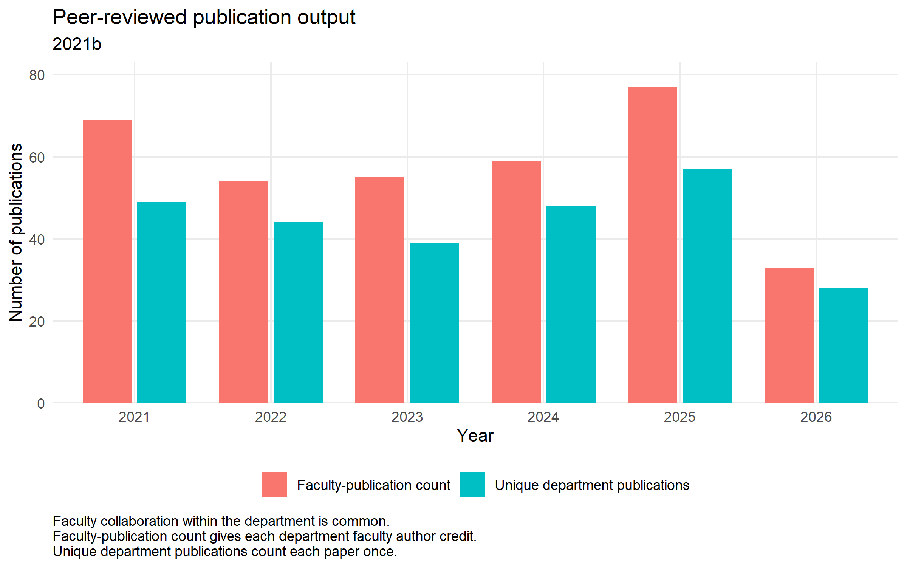
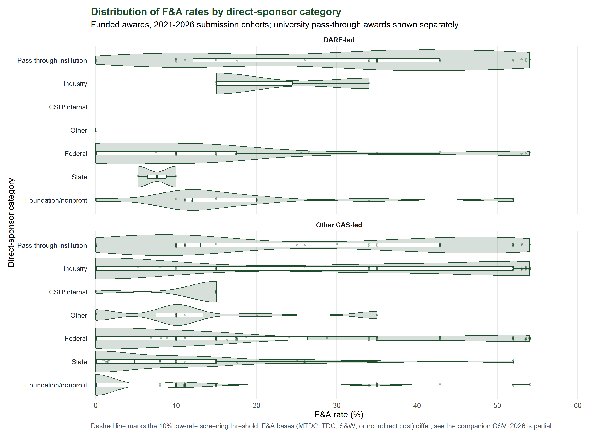
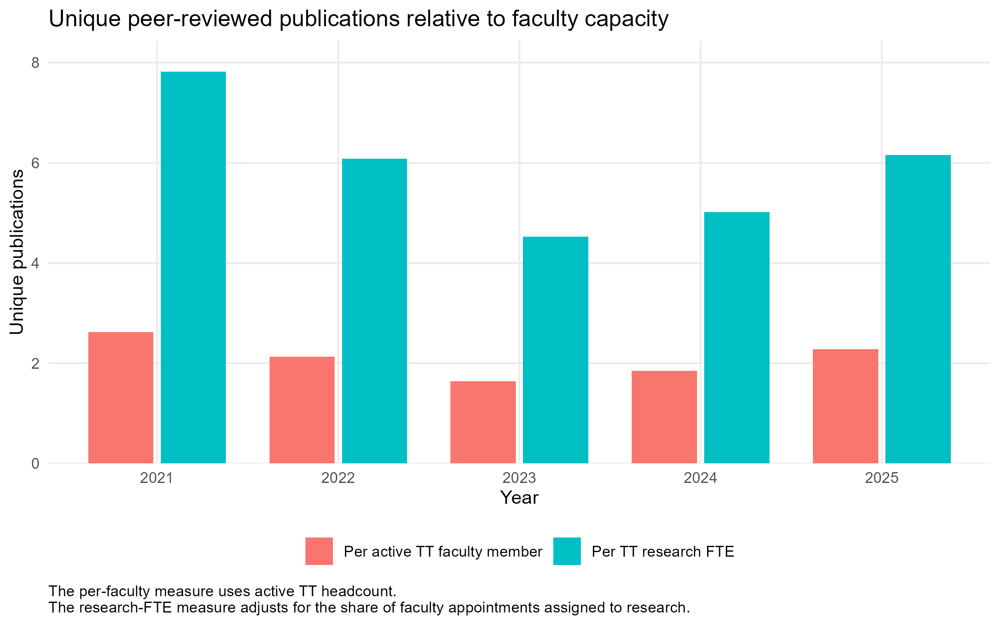
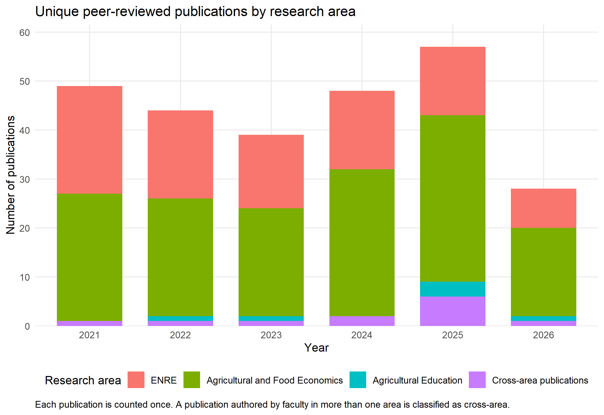
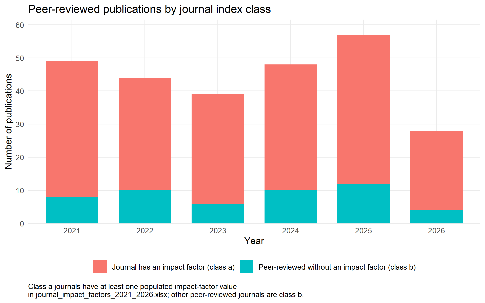

# Section 4: Research and Creative Artistry

## Research mission and departmental profile

The Department of Agricultural and Resource Economics (DARE) conducts high-quality and rigorous disciplinary and multidisciplinary research that develops knowledge and tools to improve societal well-being by addressing economic, managerial, educational, and policy problems within agri-food and resource systems. The department seeks recognition from academic, industry, and policy stakeholders as a collective leader in Environmental and Natural Resource Economics (ENRE), Agricultural and Food Economics (AFE), and Agricultural Education (AgEd).

These areas serve as research clusters within the department. They reflect disciplinary subfields and align faculty research, teaching, and Extension activities with the needs of Colorado and its stakeholders. The faculty snapshot identifies 19 faculty associated with Agricultural and Food Economics, 10 with ENRE, and three with Agricultural Education during some portion of the 2021–2026 review period. Four additional faculty records do not have a research-area classification in the current appointment data. Faculty collaborate across these areas through publications, sponsored projects, and graduate committees. Appendix Table A1 documents faculty appointments, research areas, and active years.

## Research areas

### Environmental and Natural Resource Economics

Environmental and Natural Resource Economics faculty examine how individuals, firms, communities, and public agencies respond to the management of water, land, wildlife, wildfire, energy, and other natural resources. Ten DARE faculty contributed to this area during the review period.

Water research addresses groundwater depletion, aquifer management, municipal pricing, conservation behavior, and the resilience of water systems to environmental hazards. Research on wildfire considers suppression costs, public resource allocation, labor and health effects, community exposure, and retention of the wildland firefighting workforce. Faculty working in energy study electricity markets, renewable generation, carbon markets, and interactions among energy production, land use, and environmental regulation. Wildlife and land research addresses human-wildlife conflict, livestock and rangeland management, conservation incentives, land-use change, and the economic consequences of environmental policy.

These subjects overlap. Research on wildfire connects air quality, water systems, agricultural labor, public lands, and energy production. Work on rangelands joins wildlife conservation, agricultural production, and rural livelihoods. ENRE accounted for 93 of the department’s 265 qualifying publications during 2021–2026, in addition to its contributions to 12 publications classified as cross-area work.

### Agricultural and Food Economics

Agricultural and Food Economics faculty study agricultural production, food markets, food security, food retail, consumer behavior, and rural economic development. Nineteen DARE faculty contributed to this area during the review period.

Research in agricultural production addresses livestock markets, rangeland management, climate risk, technology adoption, supply-chain resilience, and structural change in agriculture. Food security research examines how income, employment, demographic characteristics, public programs, and household constraints affect food access and diet quality. Faculty working in food markets study retail competition, pricing, product differentiation, labeling, consumer demand, and the organization of food supply chains. Rural development research considers local and regional food systems, agritourism, entrepreneurship, health-care access, labor markets, and the economic conditions of rural communities.

Agricultural and Food Economics accounted for 154 qualifying publications during 2021–2026. Research on local food systems commonly joins farm viability, market access, consumer demand, and community development. Work on food security draws on both household behavior and the structure of retail food markets.

### Agricultural Education

Agricultural Education faculty study how agricultural knowledge is taught, learned, and applied in schools, communities, and professional settings. Three DARE faculty contributed to this area during the review period, including Kellie Enns through 2025.

Current work addresses agricultural literacy, teacher preparation, pedagogical content knowledge, psychomotor skill development, educator retention, and the role of professional communities in supporting school-based agricultural education. This scholarship is integrated with teaching and outreach. Faculty use research on learning and educator preparation to inform undergraduate instruction, teacher-development programs, and agricultural literacy activities throughout Colorado. The cluster supports the preparation of future agricultural educators and connects educational research with the needs of schools, teachers, students, and agricultural communities.

Agricultural Education accounted for six qualifying publications during the review period. This publication count should be interpreted in relation to the cluster’s size, teaching responsibilities, and engagement mission.

## Publication productivity and disciplinary influence

DARE faculty produced 265 unique qualifying publications from 2021 through August 2026. Of these, 215 were published in journals with a matched impact factor and 50 were peer-reviewed journal articles without a matched impact factor in the department’s journal workbook. The same publications generated 347 faculty-publication credits because each DARE faculty coauthor receives credit for their participation.

The authoritative updated publication CSV contains 386 faculty-publication rows, which is larger than the reported department total because it is a faculty-level file and includes several types of scholarly work. Three rows were excluded because the publication fell outside the faculty member’s active CSU affiliation, leaving 383 analysis rows. Eight working-paper rows were retained for audit purposes but excluded from completed research-output counts. The remaining 375 countable faculty-output rows include 347 journal-article credits and 28 credits for book chapters, reports, and a conference proceeding. The journal productivity measure then counts the 347 journal-article credits once per department publication, using DOI where available and title, venue, and year otherwise. This removes repeated credit for papers with multiple DARE authors and produces 265 unique qualifying journal articles. Other scholarly outputs are reported separately in Appendix Table D3. The full reconciliation appears in [`output/publication_qualification_flow.csv`](output/publication_qualification_flow.csv).

Among the five completed calendar years, annual unique publication output ranged from 39 in 2023 to 57 in 2025. Output declined from 49 publications in 2021 to 39 in 2023 and then increased to 48 in 2024 and 57 in 2025. The 2026 count of 28 includes only the partial calendar year through August 27 and should not be compared directly with completed years.

| Year | Active TT faculty | Indexed journal articles | Peer-reviewed articles without a matched impact factor | Unique department publications | Faculty-publication credits |
|---:|---:|---:|---:|---:|---:|
| 2021 | 24 | 41 | 8 | 49 | 69 |
| 2022 | 23 | 34 | 10 | 44 | 54 |
| 2023 | 25 | 33 | 6 | 39 | 55 |
| 2024 | 26 | 38 | 10 | 48 | 59 |
| 2025 | 25 | 45 | 12 | 57 | 77 |
| 2026 partial | 25 | 24 | 4 | 28 | 33 |

Figure 4.1. Annual qualifying publication output, 2021–2026

Faculty capacity provides necessary context for these totals. Annual active tenure-track headcount ranged from 23 to 26 during the five completed years, while combined tenure-track research effort ranged from 8.06 to 9.56 research full-time equivalents (FTE). Unique publications per active tenure-track faculty member ranged from 1.56 to 2.28. Unique publications per tenure-track research FTE ranged from 4.30 to 6.16. The headcount measure is the more direct basis for comparison with Academic Analytics and peer departments. The research-FTE measure better reflects DARE’s internal appointment structure, in which faculty combine research with teaching, Extension, and service.

The publication portfolio also includes 12 peer-reviewed book chapters, one conference proceeding, and nine other juried or peer-reviewed scholarly works. Extension publications, policy briefs, reports, working papers, media contributions, and outreach products are not included in the peer-reviewed publication totals. Appendix Table D3 reports other scholarly outputs separately.

OpenAlex records 2,745 citations to the 265 qualifying publications, or 10.36 citations per publication. Approximately 70.6 percent of publications had at least one OpenAlex citation at the time of retrieval. Citation totals are cumulative and therefore are higher for older publication cohorts. Publications from 2021 had accumulated 1,304 citations, compared with 181 for 2025 publications and 13 for partial-year 2026 publications at the retrieval date.

| Publication year | Qualifying publications | Publications with OpenAlex citation data | Total citations | Mean citations | Median citations | Percentage cited |
|---:|---:|---:|---:|---:|---:|---:|
| 2021 | 49 | 44 | 1,304 | 29.64 | 12.50 | 87.76% |
| 2022 | 44 | 40 | 595 | 14.88 | 10.50 | 86.36% |
| 2023 | 39 | 32 | 336 | 10.50 | 7.00 | 74.36% |
| 2024 | 48 | 37 | 316 | 8.54 | 6.00 | 70.83% |
| 2025 | 57 | 52 | 181 | 3.48 | 1.00 | 63.16% |
| 2026 partial | 28 | 26 | 13 | 0.50 | 0.00 | 25.00% |

Journal placement provides a second indicator of research quality. Impact-factor values were matched for 215 publications, or 81.1 percent of the qualifying set. Among matched publications, the mean impact factor was 5.06, the median was 3.55, the minimum was 0.50, and the maximum was 63.71. The range is wide and includes a small number of publications in journals with unusually high impact factors, so the median provides a more representative measure of the typical publication.

| Impact-factor indicator | Department value |
|---|---:|
| Qualifying publications | 265 |
| Publications with a matched impact factor | 215 |
| Percentage matched | 81.13% |
| Mean impact factor | 5.06 |
| Median impact factor | 3.55 |
| Minimum impact factor | 0.50 |
| Maximum impact factor | 63.71 |

The journals with the largest numbers of DARE publications include leading disciplinary and field journals in agricultural economics, food policy, rangeland management, and environmental and resource economics. Applied Economic Perspectives and Policy published 21 qualifying articles, followed by the American Journal of Agricultural Economics, Rangeland Ecology & Management, and Western Economics Forum with 11 each. Impact-factor averages are reported only where the journal matched the maintained impact-factor workbook.

| Journal | Publications | Average impact factor | Total OpenAlex citations | Average citations per publication |
|---|---:|---:|---:|---:|
| Applied Economic Perspectives and Policy | 21 | 4.57 | 198 | 9.43 |
| American Journal of Agricultural Economics | 11 | 4.29 | 269 | 24.45 |
| Rangeland Ecology & Management | 11 | 2.71 | 50 | 4.55 |
| Western Economics Forum | 11 | Not matched | 10 | 5.00 |
| Food Policy | 7 | 6.37 | 55 | 7.86 |
| Q Open | 7 | 2.30 | 77 | 11.00 |
| Choices | 7 | Not matched | Not available | Not available |
| Journal of the Agricultural and Applied Economics Association | 6 | 1.80 | 13 | 2.17 |
| Journal of Agricultural and Resource Economics | 6 | 1.38 | Not available | Not available |
| Translational Animal Science | 5 | 1.84 | 24 | 4.80 |

These figures document citation activity and journal placement within the curated department publication set. They do not provide a field-normalized comparison with peer departments. The complete supporting tables are [`output/table_D4a_impact_factor_summary.csv`](output/table_D4a_impact_factor_summary.csv), [`output/table_D4b_citations_by_publication_year.csv`](output/table_D4b_citations_by_publication_year.csv), and [`output/table_D4c_journals_by_publication_count.csv`](output/table_D4c_journals_by_publication_count.csv).

> Editorial placeholder: Add the Academic Analytics Scholarly Research Index, peer distributions, field-weighted citation impact, and curated Google Scholar citation totals. Obtain these data from Academic Analytics and faculty Google Scholar profiles using the request in `EXTERNAL-DATA-REQUESTS.md`, then complete Appendix Tables B1 and B2 and the peer columns in Table D4.

## Sponsored projects

DARE was the lead unit on 153 proposals submitted during the 2021–2026 reporting window. Eighty-five were recorded as funded, with total award amounts of $63.42 million. Each project is counted once in its `Date Sent` submission year, and a full multi-year award is not repeated in later years. The 2026 results are partial.

Annual funded awards ranged from eight to 23 during the five completed years. Award dollars varied more sharply because large multi-year awards are assigned to a single submission cohort. The 2023 cohort contains $52.74 million of the six-year total. This concentration means that annual dollar totals describe the timing and scale of awards but should not be interpreted as annual expenditures.

Federal sponsors accounted for 62 awards and $60.18 million, or 94.9 percent of DARE’s award dollars. Foundation and nonprofit sponsors accounted for 12 awards and $2.21 million. State sponsors accounted for six awards and $333,292, industry sponsors for three awards and $621,667, and other sponsors for two awards and $72,994.

DARE’s funded portfolio involved 31 originating sponsors. The largest, the U.S. Department of Agriculture Agricultural Marketing Service, accounted for $50.87 million and 80.2 percent of all award dollars. The three largest originating sponsors accounted for 88.8 percent. This concentration is driven substantially by one large award and does not mean that 80 percent of projects came from one sponsor. The pattern nevertheless supports continued efforts to broaden the department’s funding base while maintaining its established federal partnerships.

University pass-through arrangements form a distinct part of the portfolio. Across CAS, 66 external higher-education institutions served as pass-through organizations on 259 proposals and 100 funded awards totaling $17.56 million. DARE-led activity included 51 such proposals and 30 funded awards totaling $2.02 million. Federal prime sponsors supplied 79.7 percent of DARE’s pass-through award dollars. The F&A analysis therefore separates pass-through institutions from other direct-sponsor categories because the direct institution may impose award-specific limitations or retain part of the indirect-cost recovery.

The grant records also document collaboration across CAS. Other-unit investigators participated on DARE-led projects, including nine projects involving Animal Sciences investigators, two involving Agricultural Biology investigators, and one involving Horticulture and Landscape Architecture investigators. In the reverse direction, DARE faculty served as PI or co-PI on 29 proposals led by other CAS units. Six of these proposals were funded for $1.97 million. Animal Sciences led 12 of the 29 proposals, Agricultural Biology seven, Soil and Crop Sciences six, and Horticulture and Landscape Architecture four.

> Editorial placeholder: Add annual sponsored-project expenditures, graduate research assistant expenditures, requested dollars, resolved proposal outcomes, and award dates. Obtain these data from the CSU or CAS research administration and financial systems. Use them to complete proposal success measures, Tables C5 and C6, and annual active-project counts. Blank statuses in the current export combine proposals that were not funded with proposals still in progress.

## Collaboration and interdisciplinarity

Fifty-eight of the 265 qualifying publications had two or more DARE faculty authors, representing 21.9 percent of the publication portfolio. The annual share ranged from 14.6 percent in 2024 to 30.6 percent in 2021 among completed years. Twelve publications included faculty from more than one DARE research area. Appendix Table E1 reports these measures by year.

The difference between unique publications and faculty-publication credits provides a second measure of internal collaboration. Across the review period, 265 unique publications generated 347 faculty-publication credits. The difference of 82 credits records additional DARE faculty participation on publications already counted once in the department total.

OpenAlex affiliation data identify 326 external institutions associated with coauthors on qualifying publications. Appendix Table E3 reports these publication relationships separately from funded-project relationships. The table should be read as a coverage-based inventory rather than a complete network because some publications lack OpenAlex affiliation information and institutional names may vary across records.

Internal CSU publication collaboration cannot yet be reported reliably by college, department, center, or institute. OpenAlex generally identifies Colorado State University but does not consistently resolve internal units. Sponsored-project collaboration by CAS unit is available and is reported in Appendix Table E2.

> Editorial placeholder: Add Academic Analytics collaboration indicators, CSU subunit affiliations for publication coauthors, and DARE participation and leadership in USDA Multistate Research Projects. Obtain the collaboration measures from Academic Analytics or Dawn and the multistate-project records from participating faculty or department records. Use the collected information to complete Appendix Tables E2 and E4.

## Recognition and mentoring

The awards workbook contains 17 faculty research-award, fellowship, and scholarly-recognition records during 2021–2026. The recognitions include the Monfort Professor designation; Nutrien Distinguished Scholar and Nutrien Scholar awards; the Bruce Gardner Visiting Economist Award and Bruce Gardner Award; the CSU Interdisciplinary Scholarship Individual Award; the Farm Foundation Agricultural Economics Trade Fellowship; Western Agricultural Economics Association Fellow; Agricultural and Applied Economics Association Fellow; the CAS Early Career Scholarship Impact Award; the CAS Lincoln Laureate Award; and the Excellence in Collaborative Research Award with AgNext. Two source titles are marked “x2,” so the number of recipients may exceed the number of source rows.

These recognitions were conferred by the College of Agricultural Sciences, Colorado State University, the Agricultural and Applied Economics Association, the Western Agricultural Economics Association, the Farm Foundation, and other organizations. Appendix Table F1 lists awards rather than recipients, consistent with the intended public-facing presentation.

Scholarly service provides another indicator of disciplinary standing. Editorships, associate editorships, journal editorial-board service, association leadership, elected fellow status, review panels, and leadership in professional or multistate research organizations should be summarized alongside the formal awards. These roles are not yet available in a consistent structured file.

> Editorial placeholder: Add a paragraph or table describing scholarly service during 2021–2026, including journal editorships and editorial boards, association offices, elected fellow status, major review panels, and other disciplinary leadership. Obtain these records through a targeted CV review followed by a short faculty verification request. Record organization, role, years, level, and whether the position was elected, appointed, or competitively selected.

The graduate committee workbook provides evidence of sustained faculty participation in graduate mentoring. Recorded active committee memberships ranged from 229 in 2021 to 271 in 2024 among completed years. In 2025, the file records 252 active memberships involving 33 faculty, including 59 advisor and 20 co-advisor memberships. These counts represent committee memberships rather than unique students because the source does not include a student identifier.

The department also uses onboarding, mentor committees, promotion-and-tenure review, annual department-head meetings, and optional mentoring for associate professors. These mechanisms require confirmation and documentation from department records before Table F2 can be completed.

> Editorial placeholder: Add award research areas and verify which recognitions were competitive or elected. Obtain this information from award announcements or a brief faculty verification request. Separately, add the department’s faculty mentoring and advancement mechanisms from onboarding documents, promotion-and-tenure procedures, mentor-committee records, and department-head practices. The graduate committee file documents faculty mentoring of students rather than faculty advancement supports.

## Student engagement in research

The curated publication data identify 75 student-coauthored scholarly outputs during 2021–2026. Annual counts increased from 10 in 2021 to 18 in 2024, followed by 16 in 2025. Four outputs are recorded for partial-year 2026. The student classification combines faculty CV coding with matches to the AREC conferred-degrees file. A CV-coded student coauthor remains authoritative because the registrar file does not include undergraduates, students from other departments, or students from other institutions.

The awards workbook identifies 12 student awards during the reporting window. Appendix Table G1 reports student-coauthored publications and awards by year, while Appendix Table G2 provides output-level information including research area, venue, peer-review status, and identified external institutions.

Graduate committee participation provides additional evidence of faculty-student engagement but should not be treated as a count of research participants. Committee memberships include advising and service across AREC and other graduate programs.

> Editorial placeholder: Add undergraduate versus graduate participation, graduate research assistant appointments, student conference presentations, community-engaged research projects involving students, and resulting placements or awards. Obtain these records from graduate-program files, payroll or appointment records, faculty annual activity reports, student travel records, and a targeted faculty request.

## Strategic assessment and priorities

The department’s current evidence base identifies four research strengths.

1. DARE maintained a broad publication portfolio across three research clusters, producing 265 unique qualifying publications and 347 faculty-publication credits during the review period.
2. Citation and journal data show disciplinary influence, including 2,745 OpenAlex citations and an 81.1 percent match rate to journals with impact factors.
3. Sponsored-project activity includes 85 funded DARE-led awards totaling $63.42 million and substantial participation in federal funding programs.
4. Publication and grant records document collaboration within DARE, across CAS departments, and with external institutions.

The evidence also identifies areas for improvement. Sponsor dollars are concentrated, with one originating sponsor accounting for 80.2 percent of award dollars. Internal reporting requires extensive reconciliation across CVs, OpenAlex, appointment records, grant exports, awards files, and student records. Several faculty lack stable ORCID or other identifier coverage, and Google Scholar profiles are not available in a consistent form. Peer benchmarking, expenditure measures, and several student-engagement indicators remain unavailable.

DARE can strengthen its research position through the following actions.

1. Establish an annual research-output update process that records publications, citations, grants, awards, student participation, and external collaborators in a consistent format.
2. Increase faculty use of ORCID and maintain current Google Scholar profiles to improve matching, reduce duplicate records, and support external benchmarking.
3. Maintain federal sponsor relationships while expanding proposals to foundations, industry, state agencies, and programs not represented in the current portfolio.
4. Track annual sponsored-project expenditures and graduate research assistant support separately from award amounts.
5. Record student research participation, presentations, awards, and outcomes using consistent undergraduate and graduate classifications.
6. Obtain Academic Analytics peer exports using aligned faculty populations, comparison years, and disciplinary units.
7. Document USDA Multistate Research Project participation and leadership as a distinct form of disciplinary and cross-institutional service.

Appendix Table H1 provides a working structure for assigning responsibility, time horizons, and measures of progress after department review.

## Sources

- Curated CV-based publication dataset and OpenAlex enrichment, generated through `code/02_openalex_enrich.R`, `code/03_build_analysis_file.R`, and `code/04_publication_tables.R`.
- Faculty roster and appointment splits in `data/roster.csv` and `data/appointment_splits.csv`.
- CAS proposal and award export in `data/grants_cas.xlsx`, processed through `code/05_grant_tables.R`.
- Faculty research recognitions in `data/awards.xlsx`.
- Graduate committee records in `data/grad_committee_membership.xlsx`.
- Student degree matches in `data/conferred_degrees.xlsx`.
- Counting rules and limitations in `CODEBOOK.md`, `GRANTS-CODEBOOK.md`, and `TABLES-CODEBOOK.md`.

# Appendices: Tables and Figures

The appendix structure below identifies the placement of each table and figure. CSV files are analysis outputs and can be formatted for Word after narrative review.

## Appendix A. Department composition and research areas

### Table A1. Faculty Data Snapshot

Status: Generated. Source: [`output/table_A1_faculty_data_snapshot.csv`](output/table_A1_faculty_data_snapshot.csv).

Gap: Four faculty records do not have a research-area classification in the current appointment data. Confirm whether the intended Excel Faculty Data Snapshot contains additional classifications.

## Appendix B. Academic Analytics and peer comparisons

### Table B1. Departmental Scholarly Research Index compared with selected R1 peers

Status: Pending external data. Layout: [`output/table_B1_AA_SRI_template.csv`](output/table_B1_AA_SRI_template.csv).

### Table B2. Academic Analytics Productivity Radar indicators compared with R1 peers

Status: Pending external data. Layout: [`output/table_B2_AA_productivity_radar_template.csv`](output/table_B2_AA_productivity_radar_template.csv).

Gap: Request the same comparison year, faculty definition, unit taxonomy, and metric window for DARE and all peers. See [`EXTERNAL-DATA-REQUESTS.md`](EXTERNAL-DATA-REQUESTS.md).

## Appendix C. Sponsored projects

### Table C1. Sponsored project activity by year, 2021–2026

Status: Generated. Source: [`output/table_C1_sponsored_projects_by_year.csv`](output/table_C1_sponsored_projects_by_year.csv).

| Year | Proposals | Funded awards | Award dollars | Average award |
|---:|---:|---:|---:|---:|
| 2021 | 27 | 19 | $3,275,393 | $172,389 |
| 2022 | 36 | 23 | $5,168,809 | $224,731 |
| 2023 | 30 | 17 | $52,740,418 | $3,102,378 |
| 2024 | 34 | 16 | $1,031,587 | $64,474 |
| 2025 | 20 | 8 | $1,082,918 | $135,365 |
| 2026 partial | 6 | 2 | $124,000 | $62,000 |

### Table C2. Sponsored awards by funding-source type and year

Status: Generated. Sources: [`output/table_C2_awards_by_source_year.csv`](output/table_C2_awards_by_source_year.csv) and [`output/table_C2_awards_by_source_year_long.csv`](output/table_C2_awards_by_source_year_long.csv).

### Table C3. Sponsored awards by sponsor

Status: Generated. Source: [`output/table_C3_awards_by_sponsor.csv`](output/table_C3_awards_by_sponsor.csv).

### Tables C4–C6

Status: Not supported by the current grant workbook.

- C4 requires resolved proposal outcomes, requested dollars, and compatible award timing.
- C5 requires fiscal-year expenditures, graduate research assistant expenditures, and corrected project end dates.
- C6 requires CAS department expenditures and faculty denominators.

### Supplemental grant appendices

- CAS award comparison: [`output/appendix_CAS_awards_department_summary.csv`](output/appendix_CAS_awards_department_summary.csv)
- Other CAS investigators on DARE-led projects: [`output/appendix_DARE_cross_unit_collaboration.csv`](output/appendix_DARE_cross_unit_collaboration.csv)
- DARE faculty on projects led by other CAS units: [`output/appendix_DARE_on_other_lead_units_summary.csv`](output/appendix_DARE_on_other_lead_units_summary.csv)
- Sponsor concentration: [`output/grant_sponsor_concentration.csv`](output/grant_sponsor_concentration.csv)
- Pass-through institutions: [`output/grant_pass_through_institution_summary.csv`](output/grant_pass_through_institution_summary.csv)
- F&A rates: [`output/grant_fa_rate_distribution.csv`](output/grant_fa_rate_distribution.csv)

### Appendix Figure C1. Distribution of F&A rates by direct-sponsor category

## Appendix D. Publications and disciplinary influence

### Table D1. Peer-reviewed publication output by year

Status: Generated and embedded in the main text. Full source: [`output/table_D1_publications_by_year.csv`](output/table_D1_publications_by_year.csv).

### Table D2. Peer-reviewed publications by research area

Status: Generated. Source: [`output/table_D2_publications_by_area.csv`](output/table_D2_publications_by_area.csv).

### Table D3. Other scholarly outputs by year

Status: Generated. Source: [`output/table_D3_other_scholarly_outputs.csv`](output/table_D3_other_scholarly_outputs.csv).

### Table D4. Citation and publication-impact indicators

Status: Partially generated. Source: [`output/table_D4_impact_indicators.csv`](output/table_D4_impact_indicators.csv). Department OpenAlex values are populated; peer and Google Scholar fields remain pending.

Supporting quality tables embedded in the main text:

- Impact-factor summary: [`output/table_D4a_impact_factor_summary.csv`](output/table_D4a_impact_factor_summary.csv)
- Citations by publication year: [`output/table_D4b_citations_by_publication_year.csv`](output/table_D4b_citations_by_publication_year.csv)
- Journals ranked by publication count: [`output/table_D4c_journals_by_publication_count.csv`](output/table_D4c_journals_by_publication_count.csv)
- Publication qualification reconciliation: [`output/publication_qualification_flow.csv`](output/publication_qualification_flow.csv)

### Appendix Figure D1. Publications relative to faculty capacity

### Appendix Figure D2. Publications by research area

### Appendix Figure D3. Journal indexing status

## Appendix E. Collaboration and interdisciplinarity

### Table E1. Within-department research collaboration

Status: Generated. Source: [`output/table_E1_within_department_collaboration.csv`](output/table_E1_within_department_collaboration.csv).

| Year | Qualifying publications | Publications with multiple DARE faculty | Share | Cross-area publications | Faculty involved |
|---:|---:|---:|---:|---:|---:|
| 2021 | 49 | 15 | 30.6% | 1 | 19 |
| 2022 | 44 | 9 | 20.5% | 1 | 17 |
| 2023 | 39 | 10 | 25.6% | 1 | 22 |
| 2024 | 48 | 7 | 14.6% | 2 | 21 |
| 2025 | 57 | 14 | 24.6% | 6 | 21 |
| 2026 partial | 28 | 3 | 10.7% | 1 | 21 |

### Table E2. Collaboration across CSU units

Status: Sponsored-project component generated. Source: [`output/table_E2_collaboration_across_CSU_units.csv`](output/table_E2_collaboration_across_CSU_units.csv). Internal CSU publication collaboration remains pending.

### Table E3. External and cross-institutional collaboration

Status: Partially generated. Source: [`output/table_E3_external_collaboration.csv`](output/table_E3_external_collaboration.csv).

### Table E4. Leadership in USDA Multistate Research Projects

Status: Pending external data. Layout: [`output/table_E4_multistate_projects_template.csv`](output/table_E4_multistate_projects_template.csv).

## Appendix F. Recognition and mentoring

### Table F1. Faculty research awards, fellowships, and scholarly recognitions

Status: Generated with source limitations. Source: [`output/table_F1_faculty_research_awards.csv`](output/table_F1_faculty_research_awards.csv).

### Table F2. Faculty research mentoring and advancement supports

Status: Pending department documentation. Layout: [`output/table_F2_faculty_mentoring_supports_template.csv`](output/table_F2_faculty_mentoring_supports_template.csv).

Supplemental graduate committee evidence: [`output/table_F2_grad_committee_mentoring_activity.csv`](output/table_F2_grad_committee_mentoring_activity.csv).

## Appendix G. Student engagement

### Table G1. Student participation in research and scholarly activity

Status: Partially generated. Source: [`output/table_G1_student_engagement_partial.csv`](output/table_G1_student_engagement_partial.csv).

| Year | Student-coauthored outputs | Student awards | Other student scholarly products |
|---:|---:|---:|---:|
| 2021 | 10 | 1 | 0 |
| 2022 | 12 | 3 | 1 |
| 2023 | 15 | 4 | 0 |
| 2024 | 18 | 2 | 2 |
| 2025 | 16 | 0 | 0 |
| 2026 partial | 4 | 2 | 0 |

### Table G2. Student-coauthored scholarly outputs

Status: Partially generated. Source: [`output/table_G2_student_coauthored_outputs.csv`](output/table_G2_student_coauthored_outputs.csv). Student level and outcomes remain pending.

## Appendix H. Strategic assessment

### Table H1. Summary of research strengths, opportunities, and proposed actions

| Evidence or indicator | Strength or challenge | Strategic implication | Proposed action | Responsible party | Time horizon | Measure of progress |
|---|---|---|---|---|---|---|
| 265 qualifying publications; 347 faculty-publication credits | Sustained output across a mixed appointment portfolio | Preserve productivity while recognizing research FTE | Maintain annual publication reporting by headcount and research FTE | Department research leadership | Annual | Complete annual D1 update |
| 2,745 OpenAlex citations; peer benchmarks pending | Citation evidence is available but not field-normalized | Peer claims require aligned external data | Obtain Academic Analytics and peer-distribution exports | Department and Academic Analytics contact | Before final self-study | B1, B2, and D4 peer fields completed |
| One sponsor provides 80.2% of award dollars | Award dollars are concentrated | Large awards create financial and reporting volatility | Track sponsor pipeline and expand foundation, industry, and state submissions | Department research leadership | 1–3 years | Top-sponsor share and number of active sponsors |
| Grant records contain awards but not expenditures | Research inputs cannot be compared with annual spending | C5 and C6 require another administrative source | Obtain fiscal-year expenditure and GRA expenditure data | Department and college research offices | Before final self-study if feasible | C5 and C6 completed or formally omitted |
| 58 internally collaborative publications and two-way CAS grant collaboration | Collaboration is a documented strength | Internal unit publication data would strengthen the evidence | Obtain CSU-subunit publication affiliations and record collaboration annually | Department and Academic Analytics contact | 1 year | E2 publication fields completed |
| 75 student-coauthored outputs | Students participate in scholarly production | Current records do not identify level or outcomes consistently | Add student level, presentation, GRA, and outcome fields to annual reporting | Department and graduate program | Annual | G1 and G2 missing fields reduced |
| Identifier and profile coverage varies | Output reconciliation is labor intensive | Incomplete identifiers weaken discovery and benchmarking | Encourage ORCID use and current Google Scholar profiles | Faculty and department administration | 1 year | Faculty with verified ORCID and profiles |
